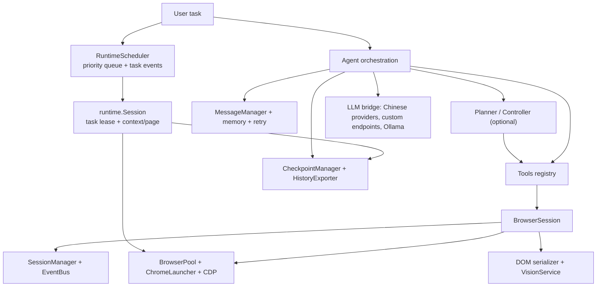
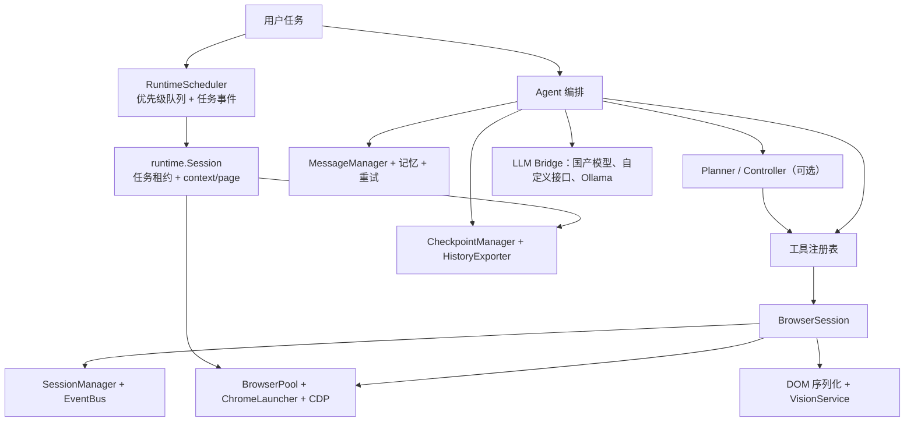

# Browser Use Bridge

**English** | [中文](#中文说明)

---

AI browser automation bridge with first-class support for Chinese LLMs, custom model providers, runtime scheduling, browser session pooling, and any OpenAI-compatible endpoint.

Built on top of [browser-use](https://github.com/browser-use/browser-use) — extending it with Chinese LLM adapters, a scheduled persistent browser runtime, vision understanding, memory, checkpointing, and more.

[](https://pypi.org/project/browser-use-bridge/1.1.0/)
[](https://pypi.org/project/browser-use-bridge/)
[](LICENSE)

---

## What's Different from browser-use

`browser-use-bridge` is a fork of [browser-use](https://github.com/browser-use/browser-use) with the following additions and changes:

### Added

| Feature | Details |
|---|---|
| **Chinese LLM adapters** | Native support for Kimi (Moonshot), Qwen (DashScope), GLM (Zhipu), MiniMax, DeepSeek — no LangChain required |
| **Custom model provider** | `ChatCustom`: point at any OpenAI-compatible endpoint with `base_url` + `api_key` |
| **Ollama local models** | `ChatOllama` with health checking, model discovery, streaming, and vision model support |
| **Browser pool and session layer** | `BrowserPool` launches persistent Chrome profiles through CDP; `BrowserSession`, `SessionManager`, and `EventBus` keep tabs and lifecycle state consistent |
| **Runtime scheduler** | `RuntimeScheduler` accepts prioritized async tasks, exposes queue/state snapshots, and emits lifecycle events for submitted, started, completed, failed, and cancelled tasks |
| **Task-bound runtime sessions** | `runtime.Session` allocates one browser lease per task, creates an isolated context/page, persists `SessionState`, and supports close, clear, preserve, and recovery policies |
| **Vision understanding** | `VisionService`: screenshot → annotated image → Vision LLM analysis; automatic fallback when DOM is sparse |
| **Planner / Controller separation** | Two-agent architecture: Planner decomposes tasks into sub-goals; Controller executes and verifies each step |
| **Memory store** | BM25 keyword retrieval (zero deps) or ChromaDB vector backend; injected into Agent context automatically |
| **Checkpoint / Resume** | `CheckpointManager`: save task state at any step, resume after interruption |
| **History export** | `HistoryExporter`: export completed runs as JSON, self-contained HTML timeline, or animated GIF |
| **Structured retry** | `RetryController`: exponential backoff, error classification, loop detection with page fingerprinting |
| **Updated default models** | Kimi `kimi-2.6`, Qwen `qwen3.6-plus`, GLM `glm-5.1`, MiniMax `MiniMax-M2.7`, DeepSeek `deepseek-v4-pro` |
| **Independent packaging** | Published as `browser-use-bridge` on PyPI with optional dependency groups per provider |

### Changed

| Aspect | browser-use | browser-use-bridge |
|---|---|---|
| Package name | `browser_use` | `browser_use_bridge` |
| CLI command | `browser-use` | `browser-use-bridge` |
| LLM base class | LangChain `BaseChatModel` | Lightweight custom `BaseChatModel` (no LangChain dependency) |
| Provider auto-detection | — | Detects Chinese gateways from `base_url` pattern |

---

## Architecture

`browser-use-bridge` is organized as a layered browser-agent runtime. The current architecture separates model access, task scheduling, task-bound browser sessions, browser pooling, agent reasoning, and persistence so each part can be tested and replaced independently.



| Layer | Responsibility |
|---|---|
| Agent orchestration | Runs the perceive → reason → act loop, or delegates planning/execution to the optional Planner / Controller split |
| LLM bridge | Normalizes OpenAI-compatible providers, Chinese model APIs, structured output, streaming, and provider-specific options |
| Runtime scheduler | `RuntimeScheduler` accepts prioritized tasks, protects the queue with `QueueFull`, reports `SchedulerSnapshot`, and emits task lifecycle events |
| Runtime session | `runtime.Session` binds one task to one browser lease, creates a context/page hierarchy, serializes `SessionState`, and can recover from saved state |
| Browser runtime | Uses `BrowserPool` and `ChromeLauncher` to keep persistent Chrome sessions available through CDP |
| Browser session state | `BrowserSession`, `SessionManager`, and `EventBus` track tabs, navigation, DOM updates, and page lifecycle events |
| Perception | Combines DOM extraction with screenshot annotation and vision-model analysis when visual context is needed |
| Persistence | Stores memory, checkpoints, and run history for resume, audit, and export workflows |
| Interfaces | Python API, CLI, MCP server, and TUI share the same runtime and tool registry |

---

## Installation

```bash
pip install browser-use-bridge
```

Install with Chinese LLM SDKs:

```bash
pip install "browser-use-bridge[cn]"        # Qwen (DashScope) + GLM (Zhipu) + Anthropic
pip install "browser-use-bridge[kimi]"       # Moonshot Kimi
pip install "browser-use-bridge[deepseek]"   # DeepSeek
pip install "browser-use-bridge[minimax]"    # MiniMax
pip install "browser-use-bridge[ollama]"     # Ollama local models
pip install "browser-use-bridge[all]"        # Everything
```

---

## Quick Start

### Python API

```python
import asyncio

from browser_use_bridge import Agent, BrowserSession
from browser_use_bridge.llm import ChatKimi

async def main():
    session = BrowserSession()
    try:
        await session.start()
        agent = Agent(
            task="Search for the latest AI news and summarize the top 3 results",
            llm=ChatKimi(model="kimi-2.6", api_key="your-key"),
            browser_session=session,
        )
        history = await agent.run()
        return history
    finally:
        await session.close()

history = asyncio.run(main())
```

### With Memory and Checkpoint

```python
import asyncio

from browser_use_bridge import Agent
from browser_use_bridge.browser import BrowserSession
from browser_use_bridge.llm import ChatQwen
from browser_use_bridge.memory import MemoryStore
from browser_use_bridge.checkpoint import CheckpointManager

async def main():
    session = BrowserSession()
    checkpoint_manager = CheckpointManager(autosave_every_steps=5)
    try:
        await session.start()
        agent = Agent(
            task="Fill in the registration form at example.com",
            llm=ChatQwen(model="qwen3.6-plus"),
            browser_session=session,
            memory_store=MemoryStore(),
        )
        history = await agent.run()
        checkpoint_manager.save(
            task_id="registration-form",
            step_counter=len(history.histories),
            current_url=await session.get_current_url(),
            agent_history=history.model_dump(mode="json"),
            label="completed",
        )
        return history
    finally:
        await session.close()

history = asyncio.run(main())
```

### CLI

```bash
# Run a task
browser-use-bridge run --task "Open baidu.com and search for Python" --provider kimi

# List all registered tools
browser-use-bridge list-tools

# Start MCP server for Claude Desktop
browser-use-bridge mcp --stdio

# Resume an interrupted task
browser-use-bridge resume <checkpoint_id>

# List saved checkpoints
browser-use-bridge checkpoint list
```

### Export History

```python
from browser_use_bridge.history import HistoryExporter

exporter = HistoryExporter(output_dir="history-exports")
artifacts = exporter.export("<checkpoint_id>", format="html")
print(artifacts["html"])
```

### Custom / Local Model

```python
from browser_use_bridge.llm import ChatCustom

# Any OpenAI-compatible endpoint
llm = ChatCustom(
    model="my-model",
    base_url="http://localhost:8080/v1",
    api_key="optional",
)
```

### Browser Pool

```python
import asyncio

from browser_use_bridge.browser import BrowserPool, BrowserProfile

async def main():
    pool = BrowserPool(pool_size=2, profile=BrowserProfile(headless=True))
    await pool.start()
    handle = await pool.acquire()
    try:
        print(pool.status())
    finally:
        await pool.release(handle)
        await pool.shutdown()

asyncio.run(main())
```

### Runtime Scheduler

```python
import asyncio

from browser_use_bridge.browser import BrowserPool, BrowserProfile
from browser_use_bridge.runtime import RuntimeScheduler, Session

async def task(pool: BrowserPool, task_id: str) -> str:
    session = Session(pool=pool, task_id=task_id, cleanup="clear")
    await session.start()
    try:
        page = session.active_page
        await page.goto("https://example.com")
        return await page.title()
    finally:
        await session.end()

async def main():
    pool = BrowserPool(pool_size=2, profile=BrowserProfile(headless=True))
    await pool.start()
    scheduler = RuntimeScheduler(pool, max_queue_size=20)
    try:
        future = scheduler.submit(task, pool, "example-task", priority=0)
        print(await future)
        print(scheduler.to_json())
    finally:
        await pool.shutdown()

asyncio.run(main())
```

---

## Supported Providers

| Provider | Class | Default Model | Install |
|---|---|---|---|
| OpenAI | `ChatOpenAI` | `gpt-4o` | built-in |
| Anthropic | `ChatAnthropic` | `claude-sonnet-4-20250514` | `[cn]` |
| Google Gemini | `ChatGoogle` | `gemini-2.0-flash` | built-in |
| Kimi (Moonshot) | `ChatKimi` | `kimi-2.6` | built-in |
| Qwen (DashScope) | `ChatQwen` | `qwen3.6-plus` | `[cn]` |
| GLM (Zhipu) | `ChatGLM` | `glm-5.1` | `[cn]` |
| MiniMax | `ChatMiniMax` | `MiniMax-M2.7` | built-in |
| DeepSeek | `ChatDeepSeek` | `deepseek-v4-pro` | built-in |
| Ollama (local) | `ChatOllama` | `llama3` | `[ollama]` |
| Custom endpoint | `ChatCustom` | configurable | built-in |

---

## Environment Variables

Create a `.env` file in your project root:

```env
MOONSHOT_API_KEY=your-kimi-key
DASHSCOPE_API_KEY=your-qwen-key
ZHIPU_API_KEY=your-glm-key
MINIMAX_API_KEY=your-minimax-key
DEEPSEEK_API_KEY=your-deepseek-key
OPENAI_API_KEY=your-openai-key
```

---

## Updating the PyPI Package

PyPI does not replace files that were already uploaded for the same package version. To publish new code, bump the version first, rebuild from a clean `dist/`, then upload the new artifacts.

```bash
# 1. Update pyproject.toml, for example:
# version = "1.1.0"

# 2. Build from a clean artifact directory
rm -rf dist build browser_use_bridge.egg-info
python -m build
python -m twine check dist/*

# 3. Upload to PyPI
python -m twine upload dist/*
```

When Twine asks for credentials, use `__token__` as the username and paste your PyPI API token as the password. After upload, verify the published package in a fresh environment:

```bash
python -m venv /tmp/browser-use-bridge-pypi-test
/tmp/browser-use-bridge-pypi-test/bin/python -m pip install -U pip
/tmp/browser-use-bridge-pypi-test/bin/python -m pip install browser-use-bridge==1.1.0
/tmp/browser-use-bridge-pypi-test/bin/python -c "import browser_use_bridge; print(browser_use_bridge.__all__)"
```

---

## License

MIT — see [LICENSE](LICENSE).

Original [browser-use](https://github.com/browser-use/browser-use) is also MIT licensed.

---

# 中文说明

**[English](#browser-use-bridge)** | 中文

---

基于 [browser-use](https://github.com/browser-use/browser-use) 构建的 AI 浏览器自动化框架，新增国产大模型支持、运行时调度、持久化浏览器运行时、视觉理解、记忆存储、断点续传等能力。

---

## 相比 browser-use 的改动说明

`browser-use-bridge` 是 [browser-use](https://github.com/browser-use/browser-use) 的 Fork 版本，主要改动如下：

### 新增功能

| 功能 | 说明 |
|---|---|
| **国产大模型适配器** | 原生支持 Kimi（月之暗面）、通义千问（DashScope）、智谱 GLM、MiniMax、DeepSeek，无需 LangChain |
| **自定义模型提供商** | `ChatCustom`：通过 `base_url` + `api_key` 接入任意 OpenAI 兼容接口 |
| **Ollama 本地模型** | `ChatOllama`：含健康检查、模型发现、流式输出、视觉模型支持 |
| **浏览器池和会话层** | `BrowserPool` 通过 CDP 启动持久化 Chrome 配置；`BrowserSession`、`SessionManager`、`EventBus` 统一管理标签页和生命周期状态 |
| **运行时调度器** | `RuntimeScheduler` 接收带优先级的异步任务，提供队列/状态快照，并为提交、启动、完成、失败、取消等阶段发出生命周期事件 |
| **任务级运行时 Session** | `runtime.Session` 为每个任务分配一个浏览器租约，创建隔离的 context/page，持久化 `SessionState`，支持关闭、清理、保留和恢复策略 |
| **视觉理解模块** | `VisionService`：截图 → 标注图像 → Vision LLM 分析；DOM 稀少时自动降级到视觉模式 |
| **Planner / Controller 分离** | 双 Agent 架构：Planner 将任务分解为子目标，Controller 逐步执行并验证 |
| **记忆存储** | BM25 关键词检索（零依赖）或 ChromaDB 向量后端；自动注入 Agent 上下文 |
| **断点续传** | `CheckpointManager`：任意步骤保存任务状态，中断后可恢复 |
| **历史回放导出** | `HistoryExporter`：导出为 JSON、自包含 HTML 时间线、或 GIF 动画 |
| **结构化重试** | `RetryController`：指数退避、错误分级、基于页面指纹的循环检测 |
| **最新默认模型** | Kimi `kimi-2.6`、千问 `qwen3.6-plus`、GLM `glm-5.1`、MiniMax `MiniMax-M2.7`、DeepSeek `deepseek-v4-pro` |
| **独立 PyPI 发布** | 以 `browser-use-bridge` 发布，各模型 SDK 按需安装 |

### 变更对比

| 方面 | browser-use | browser-use-bridge |
|---|---|---|
| 包名 | `browser_use` | `browser_use_bridge` |
| CLI 命令 | `browser-use` | `browser-use-bridge` |
| LLM 基类 | LangChain `BaseChatModel` | 轻量自研 `BaseChatModel`（无 LangChain 依赖） |
| 国产模型接入 | 不支持 | 原生支持，含 API Key 自动读取 |

---

## 架构说明

`browser-use-bridge` 当前采用分层的浏览器 Agent 运行时架构，将模型接入、任务调度、任务级浏览器 Session、浏览器池、Agent 推理和持久化能力拆开，便于独立测试、替换和扩展。



| 层级 | 职责 |
|---|---|
| Agent 编排 | 执行感知 → 推理 → 动作循环，也可切换为 Planner / Controller 分离模式 |
| LLM Bridge | 统一 OpenAI 兼容接口、国产模型 API、结构化输出、流式输出和厂商特定参数 |
| 运行时调度 | `RuntimeScheduler` 接收带优先级的任务，通过 `QueueFull` 保护队列，提供 `SchedulerSnapshot`，并发出任务生命周期事件 |
| 任务级 Session | `runtime.Session` 将一个任务绑定到一个浏览器租约，创建 context/page 层级，序列化 `SessionState`，并支持从状态恢复 |
| 浏览器运行时 | 通过 `BrowserPool` 和 `ChromeLauncher` 维护可复用的持久化 Chrome 会话 |
| 浏览器会话状态 | `BrowserSession`、`SessionManager`、`EventBus` 负责标签页、导航、DOM 更新和页面生命周期事件 |
| 感知层 | 结合 DOM 抽取、截图标注和视觉模型分析，在需要视觉上下文时自动增强 |
| 持久化 | 负责记忆、断点和运行历史，用于恢复任务、审计和导出 |
| 使用入口 | Python API、CLI、MCP Server、TUI 共用同一套运行时和工具注册表 |

---

## 安装

```bash
pip install browser-use-bridge
```

安装国产模型 SDK：

```bash
pip install "browser-use-bridge[cn]"        # 千问 + GLM + Anthropic
pip install "browser-use-bridge[kimi]"       # Kimi（月之暗面）
pip install "browser-use-bridge[deepseek]"   # DeepSeek
pip install "browser-use-bridge[minimax]"    # MiniMax
pip install "browser-use-bridge[ollama]"     # Ollama 本地模型
pip install "browser-use-bridge[all]"        # 全部安装
```

---

## 快速开始

### Python API

```python
import asyncio

from browser_use_bridge import Agent
from browser_use_bridge.browser import BrowserSession
from browser_use_bridge.llm import ChatKimi

async def main():
    session = BrowserSession()
    try:
        await session.start()
        agent = Agent(
            task="搜索最新的 AI 新闻，总结前 3 条结果",
            llm=ChatKimi(model="kimi-2.6", api_key="your-key"),
            browser_session=session,
        )
        history = await agent.run()
        return history
    finally:
        await session.close()

history = asyncio.run(main())
```

### 带记忆和断点续传

```python
import asyncio

from browser_use_bridge import Agent
from browser_use_bridge.browser import BrowserSession
from browser_use_bridge.llm import ChatQwen
from browser_use_bridge.memory import MemoryStore
from browser_use_bridge.checkpoint import CheckpointManager

async def main():
    session = BrowserSession()
    checkpoint_manager = CheckpointManager(autosave_every_steps=5)
    try:
        await session.start()
        agent = Agent(
            task="填写 example.com 的注册表单",
            llm=ChatQwen(model="qwen3.6-plus"),
            browser_session=session,
            memory_store=MemoryStore(),
        )
        history = await agent.run()
        checkpoint_manager.save(
            task_id="registration-form",
            step_counter=len(history.histories),
            current_url=await session.get_current_url(),
            agent_history=history.model_dump(mode="json"),
            label="completed",
        )
        return history
    finally:
        await session.close()

history = asyncio.run(main())
```

### CLI

```bash
# 执行任务
browser-use-bridge run --task "打开百度搜索 Python" --provider kimi

# 列出所有工具
browser-use-bridge list-tools

# 启动 MCP 服务（供 Claude Desktop 使用）
browser-use-bridge mcp --stdio

# 恢复中断的任务
browser-use-bridge resume <checkpoint_id>

# 列出已保存的断点
browser-use-bridge checkpoint list
```

### 导出历史

```python
from browser_use_bridge.history import HistoryExporter

exporter = HistoryExporter(output_dir="history-exports")
artifacts = exporter.export("<checkpoint_id>", format="html")
print(artifacts["html"])
```

### 自定义 / 本地模型

```python
from browser_use_bridge.llm import ChatCustom

# 任意 OpenAI 兼容接口
llm = ChatCustom(
    model="my-model",
    base_url="http://localhost:8080/v1",
    api_key="optional",
)
```

### 浏览器池

```python
import asyncio

from browser_use_bridge.browser import BrowserPool, BrowserProfile

async def main():
    pool = BrowserPool(pool_size=2, profile=BrowserProfile(headless=True))
    await pool.start()
    handle = await pool.acquire()
    try:
        print(pool.status())
    finally:
        await pool.release(handle)
        await pool.shutdown()

asyncio.run(main())
```

### 运行时调度器

```python
import asyncio

from browser_use_bridge.browser import BrowserPool, BrowserProfile
from browser_use_bridge.runtime import RuntimeScheduler, Session

async def task(pool: BrowserPool, task_id: str) -> str:
    session = Session(pool=pool, task_id=task_id, cleanup="clear")
    await session.start()
    try:
        page = session.active_page
        await page.goto("https://example.com")
        return await page.title()
    finally:
        await session.end()

async def main():
    pool = BrowserPool(pool_size=2, profile=BrowserProfile(headless=True))
    await pool.start()
    scheduler = RuntimeScheduler(pool, max_queue_size=20)
    try:
        future = scheduler.submit(task, pool, "example-task", priority=0)
        print(await future)
        print(scheduler.to_json())
    finally:
        await pool.shutdown()

asyncio.run(main())
```

---

## 支持的模型提供商

| 提供商 | 类名 | 默认模型 | 安装方式 |
|---|---|---|---|
| OpenAI | `ChatOpenAI` | `gpt-4o` | 内置 |
| Anthropic | `ChatAnthropic` | `claude-sonnet-4-20250514` | `[cn]` |
| Google Gemini | `ChatGoogle` | `gemini-2.0-flash` | 内置 |
| Kimi（月之暗面） | `ChatKimi` | `kimi-2.6` | 内置 |
| 通义千问（DashScope） | `ChatQwen` | `qwen3.6-plus` | `[cn]` |
| 智谱 GLM | `ChatGLM` | `glm-5.1` | `[cn]` |
| MiniMax | `ChatMiniMax` | `MiniMax-M2.7` | 内置 |
| DeepSeek | `ChatDeepSeek` | `deepseek-v4-pro` | 内置 |
| Ollama（本地） | `ChatOllama` | `llama3` | `[ollama]` |
| 自定义接口 | `ChatCustom` | 可配置 | 内置 |

---

## 环境变量

在项目根目录创建 `.env` 文件：

```env
MOONSHOT_API_KEY=your-kimi-key
DASHSCOPE_API_KEY=your-qwen-key
ZHIPU_API_KEY=your-glm-key
MINIMAX_API_KEY=your-minimax-key
DEEPSEEK_API_KEY=your-deepseek-key
OPENAI_API_KEY=your-openai-key
```

---

## 更新 PyPI 包

PyPI 不会覆盖同一版本号已经上传过的文件。发布新代码时，需要先提升版本号，再清空旧构建产物，重新打包并上传。

```bash
# 1. 修改 pyproject.toml，例如：
# version = "1.1.0"

# 2. 从干净的构建目录重新打包
rm -rf dist build browser_use_bridge.egg-info
python -m build
python -m twine check dist/*

# 3. 上传到 PyPI
python -m twine upload dist/*
```

Twine 要求输入账号时，用户名填写 `__token__`，密码粘贴 PyPI API Token。发布后建议用全新虚拟环境验证：

```bash
python -m venv /tmp/browser-use-bridge-pypi-test
/tmp/browser-use-bridge-pypi-test/bin/python -m pip install -U pip
/tmp/browser-use-bridge-pypi-test/bin/python -m pip install browser-use-bridge==1.1.0
/tmp/browser-use-bridge-pypi-test/bin/python -c "import browser_use_bridge; print(browser_use_bridge.__all__)"
```

---

## 开源协议

MIT — 详见 [LICENSE](LICENSE)。

原项目 [browser-use](https://github.com/browser-use/browser-use) 同样采用 MIT 协议。
